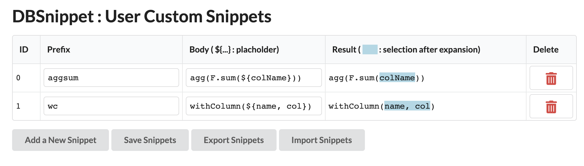

# DBSnippet

A Chrome extension to provide snippets on Databricks. I hope this extension helps Databricks users all over the world.

## Installation

[DBSnippet - Chrome Web Store]()

## Getting Started

1. Open a Databricks notebook.
1. Make sure the extension is enabled.
1. Select a cell.
1. Type `dp` and press `Tab` (`dp` will be expanded to `display()`).
1. Type `df.gb` and press `Tab` (`gb` will be expanded to `groupBy()`).

## Build from the Source

1. Clone this repository.
1. Run `npm install`.
1. Run `npm run build` (or `npm run dev`).
1. Open `chrome://extensions` on Chrome.
1. Enable `Developer mode` if it's disabled.
1. Click `Load unpacked`.
1. Select `src` in the extension directory.

## Snippet List

[Snippet List](./docs/snippets.md)

## Customize Snippets

You can add your own snippets on the option page (which is implemented using React).

1. Click the extension logo and select `options`.
2. Update the snippets.
3. Click the save button.

## How this extension works?

Each cell on the notebook has an object called `CodeMirror` which manages the cell content and state. This extension injects a JS script to override the properties related to key bindings and add new features not provided by default.

## Other Extensions

| Extension Name                             | Purpose                                   |
| :----------------------------------------- | :---------------------------------------- |
| [DBVim](https://github.com/harupy/vim)     | Enable Vim on Databricks                  |
| [DBDark](https://github.com/harupy/dbdark) | Apply dark theme on Databricks            |
| [DBToc](https://github.com/harupy/dbtoc)   | Create a table of contents with one click |

## Acknowledgements

A huge thanks to Databricks for making big data simple.

## License

MIT
